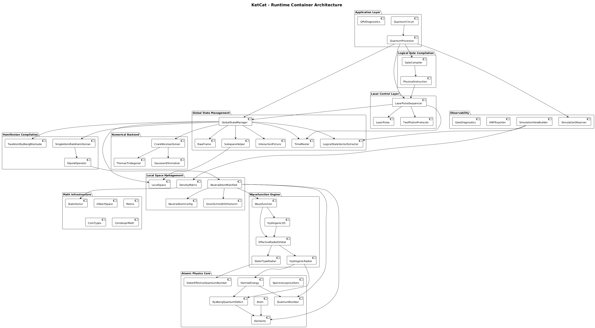

# KetCat

**Ab Initio Neutral Atom Quantum Computer Emulator**  
|😾⟩, pronounced as "Ket Cat" is an independent quantum mechanics framework in modern C++ for simulating how neutral atom quantum circuits emerge from real atomic physics.
Instead of idealized gate algebra alone, the simulator models laser-atom interactions, Hamiltonian dynamics and wavefunction evolution directly through numerical solutions of the Time-Dependent Schrödinger Equation (TDSE), where the logical states of the system is merely a projection of a larger physical Hilbert space, and quantum gates are consequences of the underlying atomic dynamics rather than being imposed as abstract matrix operations.
The project combines quantum control, neutral atom physics, compile-time software architecture and scientific visualization into a single experimental framework.

[](https://raw.githubusercontent.com/bercesadam/KetCat/master/doc/dice.mp4)

My 3-qubit Quantum Fair Dice circuit aiming a uniform distribution among the first 6 states, showcasing the new phase disk visu and precise Raman rotations of arbitrary theta angles.  (Please click on the GIF to view/download the video with full time and colour resolution.)

[](https://raw.githubusercontent.com/bercesadam/KetCat/master/doc/grover.mp4)

The first successful test on two qubits, a Grover Search demonstration on Cesium atoms, integrated on a bit more than 600 million timesteps. (Please click on the GIF to view/download the video with full time and colour resolution.)

---

### Concept: The "Private Digital Quantum Observatory"
The project is intended to be a bridge between Quantum Circuits and Atomic Physics, built with Software Engineering precision.
KetCat is not a mass-market research tool; it is an independent, one-man research and engineering project, meant to be a work of technological art, an architectural experiment and a tool for personal learning and explorations in quantum mechanics. While most quantum simulators stop at gate-level matrix multiplications, KetCat digs down to the "silicon" of the universe: it simulates the dynamics of **laser-atom interactions**. Here, quantum gates are not abstract unitary operators but the result of real physical processes governed by fundamental laws.

The project began as a fully `constexpr` logical circuit simulator. Today, the focus has shifted entirely to the Physical Layer:

*   **Ab Initio Simulation**: Numerically solving the TDSE with high temporal resolution (millions of time steps).
*   **Laser-Atom Interactions**: High-fidelity modeling of alkali atom (e.g., Cesium) pulse shaping and population transfer.
*   **Gate Design**: Realizing quantum gates via Raman lasers on Ladder Systems (for Bloch rotations and Rydberg excitation for CPHASE gates)
*   **Hybrid Basis Sets**: Combining **Slater-Type Orbitals (STO)** for core-electron shielding with **Quantum Defect Theory (QDT)** for high-lying Rydberg states.

### The "Architect" Approach (Engineering Principles)
As I am working as a System and SW Architect in the automotive industry, I've tried to bring my mindset into this project as well:

*   **Type Safety & Compile-Time Verification**: Utilizing C++20 Concepts and Templates to enforce eg. Hilbert space dimensions and operator compatibility at compile time.
*   **Data Visualization**: A custom, phase-encoded wave function renderer that transforms state vectors into visual aesthetics and "simple" debugging.
*   **Clean Architecture**: Separating the mathematical primitives, linear algebra, atomic physics, laser control and logical quantum circuits (and more). The program realizes a clean pipeline which compiles logical gates into physical instructions, then laser pulses, which finally results in a Hamiltonian used for TDSE evolution. (See the architecture section below.)

---

### Quickstart

As simple as:

```bash
mkdir build && cd build
cmake ..
cmake --build .
./smoke_test
```

The project has no dependencies, other then the standard library, you only need a C++23 compliant complier.

Each simulation yields a KWF file, which is my own binary file format for simulation output data which is consumed by the supplied Python-based visu tool,
which generates a series of PNG frames (see the visu showcase on the top of this page).

---

### Architecture & Main Pipeline

The project aims to establish a clean, maintainable, and reusable architecture, where the mathematical, physical and logical layers, as well the control logic is clearly separated.

The **initialization pipeline** (executed partially at compile time, limited by `constexpr` depth of the compiler) operates as follows:

- **Atom Configuration Input**  
  The system receives an atom configuration (e.g., via the `main()` function), describing:
  - The chemical element (currently elements from Main Group 1 are supported)
  - The operation space: a set of eigenstates (e.g., 6s, 6p, 7s)
  - The mapping of these states to logical levels \(|0\rangle\), \(|1\rangle\), and \(|r\rangle\)

- **Manifold Initialization**  
  A `NeutralAtomManifold` is constructed from the configuration.  
  The full 2D eigenfunctions are calculated in an effectively infinite spatial Hilbert space, sampled on a predefined discretization grid according to the alkali atom model (see *Model Selection Logic* for details). The constructed bases set is then orthonormalized using Modified Gram-Schmidt method for correct operation space construction.

- **Projection to Reduced Hilbert Space**  
  The system projects the physical atom state into a reduced, finite-dimensional Hilbert space (operation space), where:
  - Each eigenstate is represented by a single complex amplitude
  - All TDSE (Time-Dependent Schrödinger Equation) evolution is performed

  KetCat uses a **global full state vector** (similar to Qiskit), but defined over the operation space.  
  Its size depends on the number of modeled eigenstates; however, at minimum (including logical, at least two Rydberg states for blockage modeling, and intermediate states), it scales as: 6^QubitCount
  The logical qubit state vector is obtained as a projection from this global state.

- **Physical Parameter Computation**  
  Dipole matrix elements and Hartree energies are computed for each eigenstate and injected into the reduced model, ensuring physical realism throughout the simulation.


The **main execution flow**, governed by the `QuantumProcessor` class, is structured as follows:

- A `QuantumCircuit` (composed of `QuantumGate`s) is specified using a compile-time, type-safe DSL interface.
- Logical quantum gates are compiled into physical control instructions:
- Laser parameters and pulse sequences are generated  
- A time-dependent Hamiltonian is constructed for each time step based on the pulse envelope
- The perturbations of the state vector and Hamiltonians are being splitted into an Interaction (Dirac) picture
- The TDSE is numerically integrated over a selected subspace of the global state vector
- The "easy part", the atomic eigenenergies are solved analytically to get the Schrödinger picture for outputs calculation
- The resulting state is projected into various subspaces (ie. logical probabilities, or density matrices to get single qubit purity and basis state amplitudes for visualization and evaluation


---

### Mathematical and Physical Foundations

#### **1. Atomic Structure & Hybrid Model Selection**
For alkali atoms, the valence electron experiences a Coulomb-like potential at long range, but the tightly bound inner-shell electrons cause significant core polarization and screening. KetCat utilizes an automated, compile-time **Effective Radial Orbital** meta-generator (`EffectiveRadialOrbital` class) to select and construct the optimal **seed wavefunction**:

* **Model Selection Logic**:
    * **Hydrogenic / QDT Seed**: Selected for high angular momentum states ($l \geq 3$) or states with negligible quantum defects ($\delta_l < 0.05$). These are generated via the `HydrogenOrbitalRadial` class since the valence electron's probability density lies mostly outside the ionic core.
    * **Slater-Type Orbital (STO) Seed**: Selected for low-l states where core penetration is highly significant, managed via the `SlaterOrbitalRadial` class.

* **Effective Nuclear Charge & Screening**: For STO seeds, the framework computes the screened nuclear charge ($Z_{\text{eff}}$) at compile time using **Slater's Rules**:

    $$Z_{\text{eff}} = Z - \sigma$$

    where $Z$ is the atomic number and $\sigma$ is the shielding constant derived from the atom's specific electron configuration. The electron configuration for each alkali metal is fully resolved during compilation based solely on the $Z$ constant input, minimizing hardcoded values. The resulting radial decay parameter $\zeta$ is defined as:

    $$\zeta = \frac{Z_{\text{eff}}}{n^*}$$

* **Quantum Defects and Hydrogenic Orbitals**: For higher (eg. Rydberg) states, KetCat integrates a static lookup table calibrated against **NIST spectroscopic data** to determine the effective principal quantum number:

    $$n^* = n - \delta_l$$

    To calculate the radial part of the wavefunction for non-integer $n^*$ values, the textbook associated Laguerre polynomials are generalized using **Kummer's Confluent Hypergeometric Function** (${}_1F_1$):

```math
u_{n^*l}(r) \propto r^{l+1} \cdot e^{-\frac{r}{n^* a_{\text{eff}}}} \cdot {}_{1}F_{1}\left(-(n^* - l - 1), 2l + 2, \frac{2r}{n^* a_{\text{eff}}}\right)
```

* **2D Wavefunction Slice Generation**: The angular part of the wavefunction is universal across models and is governed by the Spherical Harmonics $Y_l^m(\theta, \phi)$, computed using Associated Legendre Polynomials $P_l^m(\cos\theta)$. The main `Hydrogenic2D` class creates planar cross-sections on an $(x, z)$ grid. To avoids numerical singularity (division by zero at the nucleus), the slice is evaluated at a tightly constrained offset $y = R_{\text{min}}$.

---

##### **2. Quantum Control, Rotating Frames & Interaction Picture**

Logical qubits in KetCat are represented as selected eigenstates of a multi-level neutral atom manifold rather than as isolated two-level systems. Quantum gate operations therefore emerge from coherent laser-driven population dynamics between physical atomic states. The simulator models these processes directly through Hamiltonian evolution, avoiding the need for idealized gate matrices during the physical propagation stage.

- **Multi-Level Control Manifold**:

  The operation space consists of a finite set of atomic eigenstates

  $$\{|0\rangle, |1\rangle, |2\rangle, \ldots, |r\rangle\}$$

  where the logical computational basis is embedded into a larger physical Hilbert space that may contain intermediate and Rydberg states. Laser fields induce coherent dipole transitions between these levels according to dipole matrix elements calculated directly from the underlying wavefunctions.

- **Rotating Wave Approximation (RWA)**:

  Direct simulation of laser-atom interactions in the laboratory frame would require resolving optical carrier oscillations that are many orders of magnitude faster than the dynamics relevant to quantum gates. KetCat therefore transforms the system into a rotating reference frame and applies the Rotating Wave Approximation.

  Terms oscillating as

  $$e^{\pm i(\omega+\omega_0)t}$$

  are neglected, while the slowly varying near-resonant terms

  $$e^{\pm i(\omega-\omega_0)t}$$

  are retained.

  This removes rapidly oscillating contributions and yields a numerically tractable effective Hamiltonian.

- **RWA Hamiltonian Construction**:

  The `MultiRwaRabiHamiltonian` class constructs a sparse tridiagonal Hamiltonian describing the coherently coupled ladder manifold

  
$$H_{\mathrm{RWA}} =
\begin{bmatrix}
\Delta_i & \Omega_i/2 \\
\Omega_i/2 & \Delta_{i+1}
\end{bmatrix}$$


  where

  - $\Omega_i(t)$ are the applied Rabi frequencies,
  - $\Delta_i$ are cumulative multi-photon detunings,
  - additional AC Stark corrections may be incorporated into the diagonal terms.

  The Hamiltonian remains Hermitian by construction while retaining only the physically relevant couplings.

- **Interaction Picture Formulation**:

  Even after applying the Rotating Wave Approximation, the Hamiltonian can naturally be decomposed into a stationary contribution and a perturbation

  $$H(t)=H_0+V(t)$$

  where

  - $H_0$ contains analytically known atomic eigenenergies,
  - $V(t)$ contains laser-induced dynamics and interaction terms.

  Instead of propagating the full Schrödinger-picture state directly, KetCat transforms the state into the Interaction (Dirac) Picture

  $$|\psi_I(t)\rangle=e^{+\frac{i}{\hbar}H_0t}|\psi_S(t)\rangle$$

  while the inverse transformation is

  $$|\psi_S(t)\rangle=e^{-\frac{i}{\hbar}H_0t}|\psi_I(t)\rangle$$

  yielding the interaction-picture Hamiltonian

  $$H_I(t)=e^{+\frac{i}{\hbar}H_0t}V(t)e^{-\frac{i}{\hbar}H_0t}$$

  In this representation the fast phase evolution generated by the stationary atomic energies is handled analytically, while the numerical solver only propagates the physically interesting perturbations.

- **Picture Management**:

  Numerical integration is performed in the Interaction Picture according to

  $$i\hbar\frac{\partial}{\partial t}|\psi_I(t)\rangle=H_I(t)|\psi_I(t)\rangle$$

  while physical observables are reconstructed in the Schrödinger Picture through

  $$|\psi_S(t)\rangle=e^{-iH_0t/\hbar}|\psi_I(t)\rangle$$

  This significantly reduces accumulated numerical phase error and enables long-duration simulations while preserving exact physical observables, state populations and phase information.

---

##### **3. Two-Photon Raman Control and Gate Synthesis**

Single-qubit gate operations are implemented through coherent two-photon laser drives described by the `TwoPhotonLaser` abstraction. Rather than directly applying logical rotation matrices to an idealized qubit, KetCat realizes logical operations through physically meaningful Raman transitions inside a multi-level atomic manifold.

- **Effective Two-Photon Coupling**:

  For a ladder-type three-level system

  $$|0\rangle \leftrightarrow |e\rangle \leftrightarrow |1\rangle$$

  driven by Pump and Stokes laser fields, the intermediate state may be adiabatically eliminated under sufficiently large detuning.

  The resulting effective coupling becomes

  $$\Omega_{\mathrm{eff}}\approx\frac{\Omega_P\Omega_S}{2\Delta}$$

  where

  - $\Omega_P$ is the Pump Rabi frequency,
  - $\Omega_S$ is the Stokes Rabi frequency,
  - $\Delta$ is the one-photon detuning from the intermediate state.

- **Rotation-Angle Synthesis**:

  The physical rotation angle of the logical qubit is determined by the accumulated pulse area

  $$\theta=\int_0^T\Omega_{\mathrm{eff}}(t)\,dt$$

  For approximately constant pulse amplitudes this simplifies to

  $$\theta\approx\Omega_{\mathrm{eff}}T$$

  where $T$ is the pulse duration.

  Consequently, logical rotations emerge naturally from the underlying physical evolution

  $$R_X(\theta),\qquad R_Y(\theta),\qquad R_Z(\theta)$$

  instead of being directly imposed as matrix operations.

---

##### **4. Rydberg Blockade and Van der Waals Interaction**

Multi-qubit entangling gates are realized through strong interactions between highly excited Rydberg states. KetCat models these dynamics using the `TwoAtomRydbergBlockade` Hamiltonian operating in the tensor-product Hilbert space of two atoms.

- **Van der Waals Interaction**:

  When both atoms are simultaneously excited into Rydberg states, long-range dipole-induced interactions produce an effective van der Waals energy shift

  $$V_{\mathrm{vdW}}=\frac{C_6}{R^6}$$

  where

  - $R$ is the interatomic separation,
  - $C_6$ is the state-dependent van der Waals coefficient.

- **Rydberg Blockade Mechanism**:

  The doubly excited state

  $$|r,r\rangle$$

  acquires an additional interaction-induced energy offset.

  When

  $$V_{\mathrm{vdW}}\gg\Omega$$

  the doubly excited state is shifted far out of resonance and simultaneous excitation becomes energetically suppressed. This phenomenon is known as the **Rydberg Blockade**.

- **Two-Atom Hamiltonian**:

  The total interacting Hamiltonian is constructed as

  $$H_{\mathrm{tot}}=(H_1\otimes I)+(I\otimes H_2)+V_{\mathrm{vdW}}|r,r\rangle\langle r,r|$$

  where the first two terms describe the independent evolution of each atom, while the final term introduces the blockade interaction.

- **Entangling Gate Generation**:

  Because the doubly excited state is dynamically suppressed, laser pulses accumulate conditional phases only on selected computational basis states. This naturally enables controlled-phase operations of the form

  $$CZ=\mathrm{diag}(1,1,1,-1)$$

  which serve as the primary entangling primitive for neutral-atom quantum computation.
  
---

##### **5. Numerical Propagation (Crank–Nicolson Solver)**
The real-time quantum dynamics driven by the laser pulses are simulated by integrating the Time-Dependent Schrödinger Equation (TDSE):

$$i\hbar \frac{\partial}{\partial t}|\Psi(t)\rangle = \mathbf{H}(t)|\Psi(t)\rangle$$

* **Crank–Nicolson Discretization**: To maintain strict **unitarity** (norm-preservation) without numerical drift, an implicit midpoint integration scheme is implemented:

    $$\left( \mathbf{I} + \frac{i \Delta t}{2\hbar} \mathbf{H}^{n+\frac{1}{2}} \right) |\Psi^{n+1}\rangle = \left( \mathbf{I} - \frac{i \Delta t}{2\hbar} \mathbf{H}^{n+\frac{1}{2}} \right) |\Psi^n\rangle$$

* **Solver Execution Modes**:
    * **Single-Atom Execution**: For single-qubit gates, the matrix $\mathbf{H}$ maintains a strict **tridiagonal** structure. The linear system is solved in optimal $\mathcal{O}(N)$ time using a specialized `CrankNicolsonSolver` leveraging the **Thomas Algorithm**. This routine is highly optimized and can execute millions of time steps efficiently.
    * **Multi-Atom Execution**: When tracking multi-atom (e.g., 2-qubit) configurations or multi-channel Rydberg-Rydberg interactions, the spatial block-diagonal layout introduces non-tridiagonal coupling terms. The engine dynamically switches to a pivoting **Gaussian Elimination** linear solver to preserve numerical precision across the higher-dimensional tensor-product Hilbert space.

---

### Known Limitations, Modeling Assumptions and Engineering Tradeoffs

KetCat intentionally focuses on coherent single-atom and small-system dynamics with high temporal resolution, prioritizing physical interpretability, numerical stability and architectural clarity over exhaustive physical completeness. The current implementation therefore makes several deliberate modeling assumptions and simplifications, which I consider as intentional design decisions:

* **Ladder-type coupling topology**  
  The TDSE solver exploits the tridiagonal structure of ladder-type interaction Hamiltonians for computational efficiency (see the numerical methods section). As a consequence, direct couplings are currently restricted to neighboring basis states. However, the simulator allows arbitrary user-defined basis construction, enabling the inclusion of auxiliary or weakly coupled states for leakage and population-drain modeling.

* **Assumptions on drive laser polarization**  
  Transition amplitudes are derived from dipole matrix elements computed directly from numerically integrated wavefunctions rather than from hardcoded selection rules. The present implementation performs this calculation on reduced radial wavefunctions, meaning that angular and polarization-dependent couplings are treated implicitly. Consequently, the simulator currently represents an effectively single-polarization interaction picture.

* **No hyperfine or spin-resolved structure**  
  The current quantum number abstraction and wavefunction generators model orbital states using the \((n,l,m)\) quantum numbers only. Spin, fine structure and hyperfine interactions are not yet included. While the project is conceptually inspired by neutral atom architectures such as QuEra's Cesium platforms, the present demonstrations utilize simplified orbital-state encodings (e.g. \(6s\) and \(7s\)) instead of hyperfine ground-state qubits.

* **Single-particle approximation for most operations**  
  Each qubit is primarily modeled as an individual atom evolving under its local Hamiltonian. Multi-atom effects are introduced only in dedicated interaction Hamiltonians (e.g. simplified Rydberg blockade modeling). Effects such as collective many-body dynamics, dense atomic interactions and relativistic corrections are currently outside the intended scope of the simulator.

* **No open-system decoherence or measurement collapse**  
  The framework presently models coherent unitary evolution only. Environmental decoherence, spontaneous emission channels, noise processes and wavefunction collapse during measurement are not yet incorporated. Reported state populations therefore correspond to idealized coherent probabilities derived from the propagated wavefunction.


