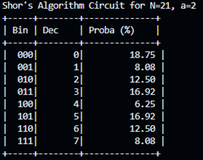
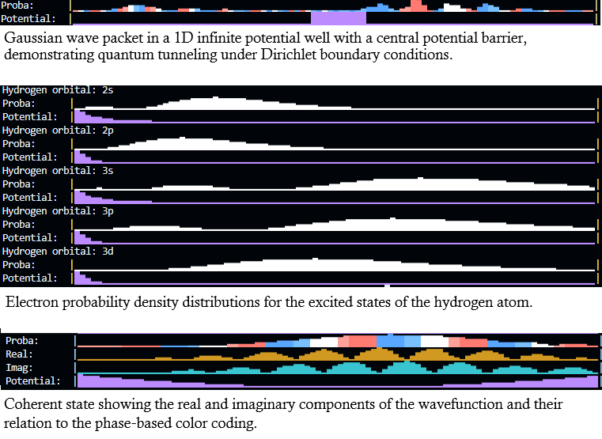

# Ket Cat - Constexpr-friendly Ab Initio Neutral Atom Quantum Computer Simulator

## Bleeding edge showcase and future plans

First successful test of a single-qubit quantum gate (Pauli-X) on a Cesium atom with STIRAP Laser drive, performed purely with solving the Time-Dependent Schrödinger (actually on ~60 million time steps): 


From the initial ideas, the project is currently being developed to be a C++ library designed for the first-principles simulation of neutral atom quantum processors. Focusing on Coherent Dynamics, enabling the precise modeling of laser-atom interactions and population transfer without the overhead of decoherence. By utilizing a hybrid basis of Slater-Type Orbitals (STO) for core-electron interactions and Quantum Defect Theory (QDT) for high-lying Rydberg states, it provides a high-fidelity emulation environment for pulse shaping and gate design in alkali-based qubit systems. 

This will create the bridge between the two "worlds", which was represented in the stable version and described in the legacy readme below.

## Readme for v2.0


|😾⟩, pronounced as “Ket Cat”, is fully `constexpr` C++ framework for simulating quantum systems: **logical quantum circuits** and **physical quantum mechanics** under a shared mathematical foundation. The project was originally named *'|Ψ⟩CC — Quantum Circuits in Compiler'* and began as a quantum circuit simulator: the original goal was to compute the evolution of quantum state vectors in constexpr time using unitary gate operations. Formally, this corresponds to solving the Schrödinger equation in a finite-dimensional Hilbert space using discrete unitary operators:

$$
|\psi_{n+1}\rangle = U_n |\psi_n\rangle
$$

Since this is mathematically a special case of Schrödinger evolution under a piecewise-constant Hamiltonian, the existing linear algebra abstractions, state vector representations, and operator formalism naturally generalized to support the computation of time evolution of physical quantum systems described by the **time-dependent Schrödinger equation**:

$$
i\hbar \frac{\partial \psi(t)}{\partial t} = H(t)\psi(t)
$$

As a result, the project evolved from a quantum circuit simulator into a unified quantum simulation framework and capable of modeling both logical and physical quantum systems - currently supporting discretized, 1D cases. 

## Conceptual Framework

This project is not intended to be a high-performance production simulator.  
Instead, it serves as:
* A conceptual bridge between **quantum circuits** and **physical quantum mechanics**
* A didactic framework for understanding quantum state evolution
* A demonstration of advanced **type-driven design** and **compile-time verification** in modern C++

At its core, |😾⟩ is built on a shared mathematical model:
* Complex-valued state vectors representing elements of a Hilbert space
* Linear operators acting on those states
* Explicit, unitary time evolution
* Easy to use API (see examples) both for circuit building and describing physical simulations

Within this framework, two complementary quantum models are supported. Both models reuse the same underlying types and abstractions; they differ only in how the evolution operators are constructed:

### Quantum Circuit Model

Discrete, gate-based evolution of logical qubits using unitary operators.
This corresponds to the standard circuit model of quantum computation with zero classically hard-coded gate logic.
Also provides a library of basic quantum gates and also a few examples (Bell and GHZ state, Shor's algorithm and my fair quantum dice circuit).

<figure>
  
  <figcaption>Example output of Shor's algorithm factoring 21</figcaption>
</figure>

### Physical Quantum Mechanics Model

Numerical simulation of wavefunctions evolving under different Hamiltonians, which can be built with an intuitive API (using functors for separate potentials). Time evolution is calculated by a numerical PDE solver for the time-dependent Schrödinger equation. Currently it's specialized to 1D cases only, so the calculation model heavily exploits the tridigonal structure of the discrete Laplacian in 1D. (There are plans to extend the functionality to more than one dimensions.)

The library provides a set of predefined, configurable seed wave functions (presenting quantum physics textbook examples, like eigenstates, Gaussian wave packets, coherent state and Hydrogen orbitals); different potentials (Zero potential well with configurable barriers, Soft Coulomb, Harmonic oscillator); and a 1D Particle-in-a-box system in which you can compile all these into one living quantum playground.

Also features an 1D oscilloscope-like visualization with phase encoding where you can witness a Schrödinger time evolution directly in a terminal, like how quantum tunneling works conceptually in the components of flash memories or the radial nodes of a hydrogen atom’s electron cloud. It can be also configured to visualize the potential in the box and also the real/imaginary components of the wave functions, which can contribute to the understanding of the given system.

<figure>
  
  <figcaption>Showcasing outputs of the supplied examples</figcaption>
</figure>

## C++ Design and Type-Level Guarantees

Beyond its mathematical foundations, the framework places strong emphasis on **type safety and compile-time correctness**, expoiting modern C++ language features extensively.

Key strengths from a C++ perspective include:

-   **Strong Type Safety**  
    Quantum states, operators, and systems are represented using distinct, explicit types.  
    Invalid compositions (e.g. applying incompatible operators or mismatched dimensions) are rejected at compile time rather than failing at runtime.
    
-   **Template-Based Dimensional Encoding**  
    Hilbert space dimensionality and system sizes are encoded directly in template parameters, enabling the compiler to enforce algebraic consistency across operations.
    
-   **Concepts, Type Traits and Compile-Time Constraints**  
    C++20 concepts are used to express mathematical requirements such as linearity, unitarity, and operator compatibility.  
    
-   **`constexpr` Evaluation and Zero Runtime Cost**  
    Where applicable, quantum state evolution and operator application can be fully evaluated at compile time, eliminating runtime cost.
    
-   **Clear Separation of Abstraction Layers**  
    The design cleanly separates:
    
    -   mathematical primitives,
        
    -   quantum evolution models,
        
    -   and system-level simulations  
        while still sharing a unified type system.
        

Together, these features make the framework not only a quantum simulation environment, but also a demonstration of advanced **type-driven design**, **metaprogramming**, and **compile-time verification** techniques in modern C++.


## Limitations

While |😾⟩ provides a unified and mathematically consistent framework for quantum simulation, several limitations should be noted:
    
-   **Not a High-Performance Simulator**
    The framework prioritizes clarity, correctness, and type safety over raw performance.
    It is not optimized for large-scale systems or production-level numerical workloads.
    
-   **Exponential State Growth**
    As with all explicit state-vector simulations, memory and computational complexity scale exponentially with system size. This limits practical simulations to relatively small Hilbert spaces.
    
-   **Numerical Precision**
    Physical quantum simulations rely on floating-point arithmetic and discretization. While stable integration schemes are used, numerical error accumulation is unavoidable for long time evolutions or fine spatial grids. Also as the project is conceptwise fully constexpr, most basic functions (trigonometry, exp etc.) is approximated with Taylor polynominals which contributes to possible numerical instability for longer simulations.
    
-   **Idealized Quantum Circuits**
    The circuit model assumes ideal unitary operations and does not model noise, decoherence, or hardware-specific effects.
    
    These limitations are intentional design choices that align with the project’s educational and exploratory goals. I also view the project as a form of digital art, since real‑world, research‑grade simulators that serve a similar purpose would gain no practical benefit from constexpr evaluation and are typically designed and optimized for high‑performance computing environments.
    

## Getting Started
    
### Build

```bash
mkdir build && cd build
cmake ..
cmake --build .
```

